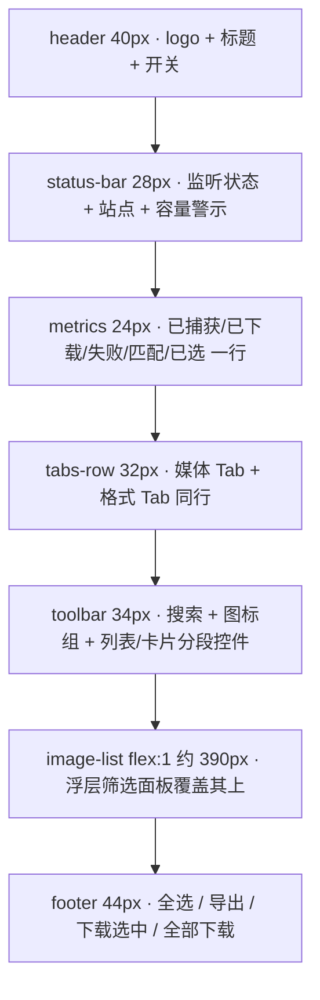

## 用户要求
对扩展界面做一次设计与交互层面的优化，两个明确目标：
1. **可查看的界面面积更大** —— 弹窗里真正能看内容的区域（媒体列表）要显著变高变宽。
2. **交互按钮和图标更有设计感** —— 现有图标风格不统一、按钮缺乏层次与反馈。

## 确认的取向
- 空间回收采用**结构性重构**：统计压成一行紧凑指标、站点行与监听状态合并、筛选面板改浮层、列表去掉高度上限自适应填满。
- 弹窗宽度 **480 → 640px**。
- 视觉风格为**精致极简**：24 网格线性图标、视图切换改分段控件、柔和阴影与主色微渐变、hover 位移与按压反馈，保持现有蓝白与深色配色。
- 范围：**弹窗 + Options 设置页**（不含官网教程页）。

## 产品概述
在不改变任何功能与交互语义的前提下，重排弹窗的信息层级、压缩常驻区块的垂直占用、并将两处界面的控件与图标统一为同一套设计语言，让用户一屏能看到更多缩略图，同时控件观感更精致。

## 核心特性
- **更大的内容区**：宽度增加约 33%；列表可见高度由约 240px 提升到约 390px，卡片视图每行多出一列。
- **合并冗余区块**：5 个统计块压成一行指标条；媒体 Tab 与格式 Tab 合并为同一行；站点信息与监听状态合并为一行状态条；容量提示并入状态条，不再单独占行。
- **筛选面板浮层化**：展开时覆盖在列表上方，不再挤压列表高度；支持点击外部与 Esc 关闭。
- **控件精致化**：统一 24 网格线性图标；列表/卡片切换改为分段控件；Tab 改 chip 形态；主按钮微渐变与轻阴影、次按钮描边态、图标按钮 hover 与按压反馈。
- **两处界面统一**：弹窗与 Options 共用一套设计令牌与控件样式，深色模式同步生效。


## 技术栈
沿用项目现有技术栈，不新增任何依赖：`Chrome 扩展 MV3` + 原生 ES Module（popup/background 为 `type: module`）+ 原生 CSS（CSS 变量 + `prefers-color-scheme` 深色覆盖）+ 内联 SVG 图标。构建仍是 `scripts/build.js` 全量复制 `src/` 到 `dist/`，无打包器、无远程资源。

## 实现思路

### 1. 先建共享令牌，再改两处界面
`src/popup/popup.css:3-40` 与 `src/options/options.css:3-24` 各自重复声明了一整套 `:root` 与深色覆盖。新增 `src/styles/tokens.css` 承载变量、深色覆盖、焦点环与基础元素样式，两个页面用 `<link rel="stylesheet" href="../styles/tokens.css">` 引入并删除自身 `:root`。

**取舍**：多一个文件、多两处 `<link>`，但配色与深色模式只需维护一处；`build.js` 是全量复制，无需改配置。音色板保持不变（蓝色 `#3b82f6` 主色系）。

### 2. 弹窗垂直预算重排（当前非列表部分约 360px → 目标约 200px）

| 区块 | 现在 | 改法 | 释放 |
|---|---|---|---|
| `.header`（12px padding、15px 标题） | ~48px | padding 收窄、标题 13px、开关 36×20 | ~8px |
| `.capacity-hint` | ~36px（条件显示） | 并入状态条，作为内联警示徽标 | ~36px |
| `.stats-bar`（5 个 18px 大字块） | ~62px | 一行紧凑指标条（11px 数字 + 10px 标签内联） | ~38px |
| `.media-tabs` + `.format-tabs` | 36 + 34 = 70px | 包一层 `.tabs-row` 放同一行（两个容器都在，JS 无需改动） | ~38px |
| `.toolbar` | ~34px | 搜索框 + 图标组 + 分段控件一行 | 持平 |
| `#filter-panel` | 展开 ~200px+ | 改绝对定位浮层，常态 0 高度 | 展开时全额省下 |
| `.image-list` | `max-height:320px`、实际约 240px | 去上限、`flex:1 1 auto`、`min-height:200px` | 自适应填满 |
| `.footer` | ~46px | 44px，主按钮渐变、次按钮描边 | ~2px |
| `.site-row` + `.status-indicator` | 30 + 36 = 66px | 合并为一条 28px 状态条 | ~38px |
| `.rating-row` | 一次性 | 保持 `hidden` 语义，零常驻高度 | 保持 |

结果：列表可见高度约 390px（原约 240px），超出预期的 80~120px。

### 3. 视觉与交互（精致极简）
- **图标**：全部重绘为 `viewBox="0 0 24 24"`、`stroke-width="1.75"`、`stroke-linecap/linejoin="round"`，渲染尺寸统一 20px（工具栏）/ 16px（行内）。工具栏 6 个图标与 lightbox 3 个按钮一并替换。
- **视图切换**：`btn-view-list` / `btn-view-card` 包进 `.segmented` 分段控件容器，`.active` 语义不变，`updateViewButtons()` 无需改动。
- **按钮**：主按钮 `linear-gradient(180deg, var(--primary), var(--primary-hover))` + 轻阴影，hover `translateY(-1px)`、active `scale(.98)`；次按钮描边幽灵态；图标按钮 28×28、圆角 6px、hover 背景 + 主色图标。
- **Tab**：由实心蓝块改 chip 形态（圆角 999px、active 主色浅底 + 主色文字），弱化计数徽章。
- **列表项**：hover 背景 + 左侧 2px 主色指示条，选中态浅蓝底。
- 过渡统一 `160ms cubic-bezier(.4,0,.2,1)`，并补 `prefers-reduced-motion` 降级。

### 4. Options 页
容器 640 → 720px、卡片圆角 12px + 轻阴影 + 顶部主色细条、表单行改为「标签 / 控件 / hint」两列栅格、按钮与开关与弹窗同一套、toast 改居中浮层。**所有字段 id 与行为保持不变**（`options.js` 的 `fields` 映射与 save/reset 逻辑不能断）。

## 执行要点（防回归）
- **DOM 契约**：`popup.js` 的 `el` 映射（40+ 个 `#id`）、`data-*` 委托属性（`data-media-type` / `data-format` / `data-source` / `data-sort` / `data-similar` / `data-group` / `data-id` / `data-action`）以及渲染出的类名全部保留；只改包裹层与样式。
- **筛选面板**：`popup.js:241-242` 的 `el.filterPanel.style.display = visible ? 'none' : 'flex'` 必须改为 class 切换，并新增「点击外部关闭」与「Esc 关闭」（与 lightbox 的 keydown 合并，`lightboxOpen` 时优先处理预览）。
- **卡片列数**：`.card-mode` 的 `repeat(auto-fill, minmax(var(--content-size), 1fr))` 保留，宽度变宽后自然多列，JS 不动。
- **i18n 硬约束**：`__tests__/i18n.test.js` 会校验 popup/options 的 HTML 与 JS 中**注释外不得出现 CJK/全角字符**，且引用的 key 必须双语存在。本次预计 **0 个新 key**（复用现有 `stat*` / `tooltip*` / `btn*`），若确需新增必须中英同步。
- **深色模式**：`prefers-color-scheme: dark` 的整组覆盖必须完整保留并随新令牌迁移。

## 架构设计（弹窗新结构）



## 目录结构

```
src/
├── styles/
│   └── tokens.css        # [NEW] 共享设计令牌：变量、深色覆盖、焦点环、基础元素；popup 与 options 共同引用
├── popup/
│   ├── index.html        # [MODIFY] 宽度适配 640；统计改一行指标条；Tab 合入 .tabs-row；
│   │                     #          站点行与状态行合并为 .status-bar；工具栏图标重绘、视图切换改分段控件；
│   │                     #          筛选面板改浮层容器；保留全部 id 与 data-* 契约
│   ├── popup.css         # [MODIFY] 删除自有 :root（改引 tokens.css）；重写布局与控件样式；
│   │                     #          列表去 max-height 改 flex 自适应；新增分段控件、chip Tab、浮层、图标按钮等
│   └── popup.js          # [MODIFY] 仅 3 处：筛选面板显隐改 class 切换、新增点击外部/Esc 关闭、
│                         #          （可选）空态插画微调；其余逻辑与 id 不动
├── options/
│   ├── index.html        # [MODIFY] 引入 tokens.css；卡片/栅格结构调整；字段 id 与顺序不变
│   ├── options.css       # [MODIFY] 删除自有 :root；卡片、表单栅格、按钮、开关、toast 统一到新设计语言
│   └── options.js        # [MODIFY] 预计无需改动；仅在 toast 类名变化时同步
└── _locales/
    ├── zh_CN/messages.json # [MODIFY] 仅在确有新文案时同步新增（预计为 0）
    └── en/messages.json    # [MODIFY] 同上，必须与 zh_CN 同集合、同占位符
```

## 关键结构（新令牌文件契约）

```js
// src/styles/tokens.css 需覆盖的变量（值沿用现有色板，不换色系）
// --bg / --bg-secondary / --bg-hover / --bg-selected
// --border / --border-strong
// --text / --text-secondary / --text-muted
// --primary / --primary-hover / --primary-soft
// --success / --danger / --warning
// --radius / --radius-sm / --radius-lg
// --shadow-sm / --shadow-md
// --ease / --duration（过渡令牌，供 hover 与按压反馈统一）
// 深色模式：@media (prefers-color-scheme: dark) 内完整覆盖同一组变量
```


## 设计风格
精致极简（Refined Minimalism）：在现有蓝白 + 深色配色体系内，靠**层级、留白节奏与微反馈**建立质感，不换色系、不加装饰性元素。统一 24 网格线性图标、信息密度更高的一行式指标、chip 化标签、分段控件与渐变主按钮，让界面在 640×600 的有限画布里既更宽松又更精致。

## 布局结构（自上而下）
- **顶部条**：左侧品牌标识（20px 图标 + 13px 标题），右侧监听开关（36×20 圆角滑块），整条 40px。
- **状态条**：监听状态点（带呼吸动效）+ 文案居左；当前站点与「暂停 / 恢复」按钮居右；容量接近上限时以警示徽标内联在同一行。
- **指标条**：五个指标单行排列，数字 11px 半粗、标签 10px 次级色，中间用细分隔点，整条 24px。
- **标签行**：媒体类型（图片 / 视频）为左侧分段控件，格式 chip 组右侧横向滚动，两者同行 32px。
- **工具栏**：搜索框（圆角填充态、聚焦外发光）居左占满剩余；图标组（筛选、分组、滚动抓取、清空）与列表 / 卡片分段控件居右，整行 34px。
- **内容区**：网格或列表填满剩余高度；筛选面板以浮层形式覆盖在内容区上方（圆角、阴影、最大高度 300px）。
- **底栏**：两个主操作（下载选中 / 全部下载）用渐变实心，两个次操作（全选 / 导出列表）用描边幽灵态，整条 44px。

## 组件设计
- **图标按钮**：28×28、圆角 6px、1px 浅描边；hover 时背景转次级底色、图标转主色并上移 1px；按压缩放 0.98；禁用态降透明度。
- **分段控件**：容器内浅底、选中项白底 + 轻阴影的滑块，切换带 160ms 位移过渡。
- **主按钮**：垂直微渐变 + 1px 柔和投影，hover 加深并上移，按压回落；禁用态灰化不可点。
- **标签 chip**：圆角 999px、无边框，选中态主色浅底 + 主色文字，计数徽章弱化显示。
- **列表项**：hover 浅底 + 左侧 2px 主色指示条；选中态浅蓝底 + 实心勾选框；操作图标在 hover / 聚焦时淡入。
- **空态**：插画与文案居中，留白更大，与整体留白节奏一致。

## 动效与响应
所有过渡统一 160ms 标准缓动；仅在 hover / 按压 / 折叠展开这类即时反馈上使用位移与缩放；列表滚动、浮层展开禁用昂贵动画；补充 `prefers-reduced-motion` 降级。深色模式下阴影减弱、描边增强，保持对比度。

## Agent Extensions
### Skill
- **project-structure**
  - 用途：决定 `src/styles/tokens.css` 的落点、图标与样式资源的组织方式，并审计「共享令牌文件 vs 两处重复声明」这一结构决策
  - 预期产出：确认目录划分符合 colocation 与反模式条款（不新增 catch-all 文件、不建桶文件），并给出最终文件布局结论

### SubAgent
- **code-explorer**
  - 用途：动手前核查 `popup.js` 对全部 `#id`、`data-*` 属性与渲染类名的引用点，以及 `popup.css`、`options.css` 中所有需要迁移的选择器，形成「不可改动清单」
  - 预期产出：一份 DOM 契约与样式影响清单，确保重构不破坏事件委托与渲染逻辑

- **lsp-code-analysis**
  - 用途：对 `#filter-panel`、`btn-view-list`、`btn-view-card`、`.stats-bar`、`.site-row`、`.status-indicator` 做引用与影响分析
  - 预期产出：精确定位需要同步修改的 JS 行（含 `popup.js:241-242` 的显隐逻辑）与 CSS 规则，避免遗漏引用点
