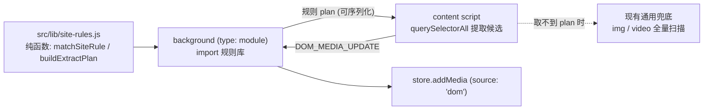

## 产品概述
为 v1.6「差异化放大」完成立项细化，输出一份自包含的逐任务开发计划设计文档，作为 v1.6 后续实现的唯一依据。文档须覆盖 RoadMap v1.6 章节的全部五个任务（V16-01 ~ V16-05），体例与 v1.3 / v1.4 / v1.5 既有设计文档一致。本轮只交付文档，不改动 `src/` 任何代码。

## 核心内容
- **V16-01（P0）平台适配器框架**：把现有的通用 DOM 兜底捕获升级为「数据驱动的站点感知捕获」。规则与引擎分离、规则可社区贡献；本期只内置 1 个示例规则，确保框架可跑可测，具体站点规则留待真实反馈再补。
- **V16-02（P1）视频直链下载**：视频默认不走 ZIP，复用 V15-01 已落地的大文件旁路与已预留的 `DOWNLOAD_SELECTED` 通路。
- **V16-03（P1）智能筛选探索**：感知哈希去相似图、清晰度评分、主色聚类；本地计算优先，外部 API 默认关闭（本期是否纳入需在文档中定论）。
- **V16-04（P1）增长功能**：扩展图标角标显示新增捕获数、全局快捷键、页面右键「下载此图」菜单。
- **V16-05（P2）增长运营**：docs 落地页 SEO 与场景化教程、商店评分引导、开源社区 Issue 模板。
- **RoadMap 联动**：v1.6 章节去掉「方向性，立项时再细化」表述，补入设计文档引用块，第 9 节变更记录新增一行。

## 交付物
1. **新建** `specs/features/v16-differentiation-expansion/2026-09-22-v16-differentiation-expansion-design.md`，章节为：概述（背景 / 目标 / 非目标 / 前置）、任务总览与实现顺序、用户场景、功能需求与实现方案（FR-1 ~ FR-5）、消息类型与数据结构变更汇总、边界情况、涉及文件、测试计划、交付与手动验证清单。
2. **修改** `RoadMap.md`：v1.6 章节加设计文档引用块（格式照抄 v1.3/v1.4/v1.5），并更新变更记录。

## 关键约束
- 文档必须回答并定论若干开放问题，不能含糊带过：规则文件在「content script 是 classic 脚本、不能 import ES module、且不引入打包器」约束下的落点；V16-02 的策略表达方式；V16-03 在无 DOM 测试环境下的可测性；V16-04 的角标计数口径与右键入库的 `source` 取值。
- 合规边界须写明：只做「页面上已渲染内容的更精准定位」，不做接口逆向、不绕过登录与付费墙。
- 引用的文件路径、函数名、常量名、消息类型必须取自真实代码，任务编号与 RoadMap 逐字一致。


## 技术栈与约束
本轮为文档交付，**不改动 `src/`、不新增 npm 依赖、不执行构建**（`npm test` 155 项与 `npm run build` 现状不受影响）。文档描述的技术方案必须落在现有栈内：原生 ES modules、无打包器、MV3、`chrome.storage.local`、Jest（`testEnvironment: "node"`，**无 jsdom**，`moduleFileExtensions: ["js"]`）。

## 实现方式
文档按 v15 设计文档的九章结构撰写，重点是把 RoadMap 里五条一句话任务展开为「需求 / 方案 / 验收」可执行条目，并对以下开放问题逐条给出结论与取舍理由（这是本轮文档的核心价值）：

1. **V16-01 规则落点（最关键）**。现状约束：`src/content/index.js` 是 classic IIFE，不能 `import` ES module；background 是 `type: module`，可以 import。候选方案与倾向：
   - (a) 规则作为第二个 `content_scripts` 文件（`js: ["content/site-rules.js", "content/index.js"]`），写 `globalThis`，零异步零新权限，代价是规则文件不能用 `export`，单测需用 `node:vm` 加载；
   - (b) 规则为 JSON + `web_accessible_resources`，content script 启动时 `fetch(chrome.runtime.getURL(...))` 一次并缓存，代价是引入异步初始化与 manifest 新字段；
   - (c) 规则存放在 `src/lib/` 的 ESM 模块，background import 后通过消息下发给 content script，代价是一次消息往返与失败降级路径。
   倾向：**(c) 的数据分离 + 引擎纯函数化**——匹配与字段映射做成 `src/lib/site-rules.js` 的纯函数（`matchSiteRule(url)`、`buildExtractPlan(rule)`，返回可序列化的选择器与字段映射），可直接被 Jest 覆盖；content script 只保留「按 plan 做 `querySelectorAll` 提取」这一薄层 DOM 适配。理由是零重复实现、零 manifest 变更、纯函数可测；文档需与 (a) 做一次明确对比后定论。
2. **规则 schema**：至少含 `id` / `label` / `version` / `match`（host 与 path）/ `itemSelector` / 字段映射（url / width / height / duration / poster / alt）/ `lazy`。须说明规则失效时如何降级回现有通用兜底、选择器零命中时的行为。
3. **V16-02 策略表达**：在 `DEFAULT_SETTINGS.transfer` 增加视频策略（如 `videoDirect: true`）并在 `planTransfer()` 中增加 `mediaType` 维度判定（当前只按 `size` 与两个阈值判定，签名已接收 `settings`，扩展成本低）；复用 `constants.js` 中已声明「预留给 V16-02」的 `DOWNLOAD_SELECTED`；明确 Options 是否暴露、以及「用户点一次下载却得到散文件」的期望管理与 i18n 文案新增。
4. **V16-03 可测性与性能**：算法核心必须是纯函数（接收 `Uint8ClampedArray` 像素数组），否则在 node 环境无法测；像素来源需评估放在 offscreen（已有 DOM 上下文，但当前是按需创建、用完即关）还是 popup；须定论计算时机（推荐按需触发而非捕获期），并说明 `phash` 字段的存储开销与对 `_normalizeImage` / `addMedia` 的影响。
5. **V16-04 权限与体验**：`chrome.action.setBadgeText` 不需要新权限；`chrome.commands` 是 **manifest 顶层字段而非 `permissions` 条目**（须写清，并按 AGENTS.md 清单说明对商店审核的影响）；右键「下载此图」用 `contexts: ['image']` + `info.srcUrl` 入库时 `source` 取什么值必须定论——**注意现有来源筛选只有 all / network / dom 三态（popup 与 `store.getFilteredMedia` 均已实现），新增第四种取值会连带影响 UI**。角标计数口径与清零时机若需新消息类型，必须先落 `constants.js` 的 `MESSAGE_TYPES`。
6. **V16-05 产出边界**：docs 落地页保持「无远程资源」；评分引导使用商店链接；列出 `.github/ISSUE_TEMPLATE/` 需新增的模板清单。
7. **测试与现实约束一致**：呼应 RoadMap 技术债中「v1.5 评估 content/offscreen 的可测性」，明确 v1.6 把可测部分收敛为纯函数（site-rules 匹配、`planTransfer` 视频分支、角标计数、phash），`content` / `popup` / `offscreen` 仍只能手动验证。
8. **度量指标**：说明如何在零上报前提下本地测量 RoadMap 给 v1.6 定的目标（下载成功率 ≥97%、大批量打包失败率 <0.5%）。

## 架构设计（规则接入路径，推荐方案，文档需定论）

要点：规则库与引擎是纯数据 + 纯函数，卡在可单测的 `src/lib/` 层；content script 只增加一层薄的「按 plan 提取」分支；规则不可用时行为与现状（通用兜底）完全一致。

## 目录结构
```
open-download/
├── specs/features/v16-differentiation-expansion/
│   └── 2026-09-22-v16-differentiation-expansion-design.md   # [NEW] v1.6 唯一依据，九章结构
└── RoadMap.md                                               # [MODIFY] v1.6 章节补引用块 + 变更记录
```
文档内部将规划（但不实现）以下文件：`src/lib/site-rules.js`（[NEW] 规则库与匹配纯函数）、`src/content/index.js`（按 plan 提取）、`src/background/index.js`（规则下发与 `planTransfer` 视频分支）、`src/lib/constants.js`（`transfer.videoDirect`、可能的 `MESSAGE_TYPES` 新增）、`src/options/*`、`src/manifest.json`（`commands` 字段）、`src/_locales/{zh_CN,en}/messages.json`（新增 key 必须双语同步）、`.github/ISSUE_TEMPLATE/*`、`docs/*`（SEO 与教程页）。

## 关键代码结构（规则 schema 与变更清单草案，文档中定稿）
```js
// 规则条目（草案）
{ id, label, version, match: { hosts: [], pathPattern },
  itemSelector, fields: { url, width, height, duration, poster, alt }, lazy }

// 第 5 节需给出的增删清单（草案）
// DEFAULT_SETTINGS: +transfer.videoDirect, +ui.dedupeSimilar(若纳入 V16-03)
// MESSAGE_TYPES: 角标清零 / 规则下发 相关的增删（按定论填写，新增前须先落 constants.js）
// media 记录: +phash(若纳入 V16-03)、source 取值是否扩展（影响来源筛选三态）
```

## Implementation Notes
- 文档引用的每个符号都要能 grep 到；现状行为描述以函数名为锚点（如 `planTransfer()`、`handleDomMediaUpdate()`、`isCaptureAllowed()`）。
- 不得把未定论的方案写成已决；每个开放问题都要有结论 + 取舍理由 + 被否方案的放弃原因。
- 非目标要显式列出（m3u8 分片合并、外部 API 智能筛选、Firefox 适配、绕过登录/付费墙），避免范围蔓延。
- 第 9 节手动验证清单必须可操作（具体步骤与观察点），不写「验证功能正常」这类空话。


## Agent Extensions
### Skill
- **project-structure**
  - Purpose: 为 V16-01 的规则引擎与规则文件确定代码落点，并在文档产出后核对「新增文件是否与现有 `src/lib` / `src/content` 分层一致」
  - Expected outcome: 给出「规则库 + 纯函数引擎 + content 薄适配层」三者的目录归属结论与理由，据此写定 FR-1 的涉及文件清单
- **content-creation**
  - Purpose: 细化 FR-5（V16-05 增长运营）的产出物——docs 落地页 SEO 关键词与场景化教程选题、商店评分引导文案方向、开源社区 Issue 模板清单
  - Expected outcome: 一份可执行的 SEO/教程/引导内容骨架（关键词、页面标题、教程选题、模板字段），写入文档 FR-5 章节

### SubAgent
- **code-explorer**
  - Purpose: 文档产出后做只读自检，核对第 7 节列出的文件是否真实存在、引用的函数与常量与消息类型是否可 grep 到、V16-01~05 编号与 RoadMap 是否逐字一致、两条相对链接是否可达
  - Expected outcome: 输出「引用项 → 是否存在 → 文件:行号证据」的核对结论，消除文档中的臆造路径与臆造 API
