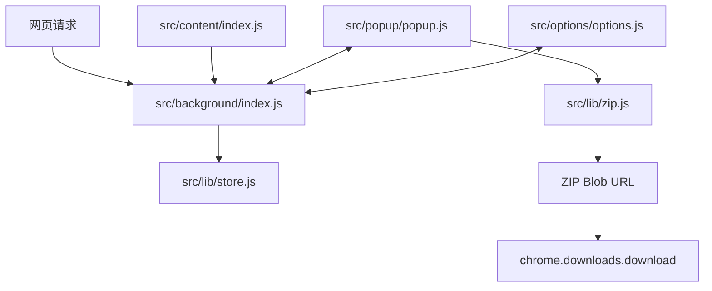

# 媒体分类、ZIP 批量下载与卡片视图设计文档

## 1. 概述

### 1.1 问题/背景

Open Download 当前已经支持监听网页中的图片请求，在 Popup 中展示图片列表，并支持筛选、选择、导出和批量下载。但现有能力仍有三个明显限制：

- 资源类型只有图片，无法捕获和管理视频资源。
- 批量下载仍是逐个调用 `chrome.downloads.download`，浏览器可能对每个文件弹出保存位置询问，体验打断明显。
- Popup 只有列表视图，适合查看 URL、域名、大小等元信息，但不适合快速浏览大量图片缩略图。

本次功能在当前工程化结构基础上扩展为“媒体资源管理”：支持图片/视频切换、按格式切换、批量 ZIP 下载、列表/卡片视图切换。

### 1.2 目标

- 支持通过一级 Tab 在「图片」和「视频」之间切换。
- 支持在当前媒体大类下通过二级 Tab 按格式切换，例如图片的 `jpeg`、`jpg`、`png`、`webp`，视频的 `mp4`、`webm`、`mov`、`m3u8` 等。
- 支持「全部下载」和「下载选中」以 ZIP 压缩包形式一次性下载，默认不弹出每个文件的保存询问。
- 支持列表视图和卡片视图切换；卡片视图参考图三，以网格卡片展示缩略图、尺寸和选中状态。
- 保持 `src/` 到 `dist/` 的轻量构建方式，不引入复杂前端框架。
- 保持现有图片捕获、筛选、导出、设置、统计能力兼容。

### 1.3 非目标

- 不实现视频转码、图片压缩、图片裁剪或格式转换。
- 不解析所有流媒体分片并合成为完整视频文件；`m3u8` 可作为可捕获资源类型，但完整 HLS 合并不在本次范围内。
- 不绕过站点鉴权、防盗链或浏览器跨域限制。
- 不引入完整 SPA 框架或重型打包器。
- 不改变 Chrome 的默认下载目录策略；本功能只保证单次触发一个 ZIP 下载，并设置 `saveAs: false`。

## 2. 用户场景

### 场景 1: 在图片和视频之间切换

**Given** 用户已经开启监听并浏览包含图片和视频的网页。  
**When** 用户在 Popup 顶部点击「图片」或「视频」Tab。  
**Then** 列表或卡片区域只展示对应媒体类型，统计区域显示当前筛选结果数量。

### 场景 2: 按图片格式筛选

**Given** 用户当前停留在「图片」Tab，已捕获 `jpg`、`jpeg`、`png`、`webp` 等资源。  
**When** 用户点击格式 Tab，例如 `webp`。  
**Then** Popup 只展示当前媒体类型下该格式的资源。

### 场景 3: 按视频格式筛选

**Given** 用户当前停留在「视频」Tab，已捕获 `mp4`、`webm`、`mov` 或 `m3u8` 资源。  
**When** 用户点击对应格式 Tab。  
**Then** Popup 只展示匹配格式的视频资源；如果格式没有资源，显示空状态。

### 场景 4: 一次性下载 ZIP 包

**Given** 用户已经选中若干资源，或当前筛选结果中有多个资源。  
**When** 用户点击「下载选中」或「全部下载」。  
**Then** 扩展拉取目标资源，打包为一个 ZIP 文件，并调用一次 `chrome.downloads.download` 下载该 ZIP，不对每个资源重复询问保存位置。

### 场景 5: 切换到卡片视图浏览图片

**Given** 用户正在查看捕获的图片。  
**When** 用户点击视图切换按钮，从列表视图切换到卡片视图。  
**Then** Popup 以参考图三类似的网格卡片展示缩略图，卡片底部覆盖显示尺寸，用户可点击卡片选中或取消选中。

### 场景 6: 切换回列表视图查看元信息

**Given** 用户正在卡片视图中浏览资源。  
**When** 用户点击列表视图按钮。  
**Then** Popup 恢复当前列表视图，展示文件名、域名、大小、MIME、状态等详细信息，并保留已选中状态。

## 3. 功能需求

### FR-1: 媒体类型捕获

- Background 需要同时捕获图片和视频资源。
- 图片资源来源包括 `details.type === 'image'`，或 MIME/扩展名命中图片类型。
- 视频资源来源包括 `details.type === 'media'`，或 MIME/扩展名命中视频类型。
- 捕获记录需要新增 `mediaType` 字段，取值为 `image` 或 `video`。
- 捕获记录需要新增 `extension` 字段，统一保存小写扩展名，不带点号，例如 `jpg`、`png`、`mp4`。
- 对无法判断的资源不进入媒体列表，避免把普通接口、脚本和样式误收进来。

### FR-2: 媒体类型和格式 Tab

- Popup 顶部新增一级媒体 Tab：`图片`、`视频`。
- 一级 Tab 需要展示当前媒体类型下的数量。
- Popup 在一级 Tab 下新增二级格式 Tab：`全部`、以及当前媒体类型支持的格式。
- 图片格式至少支持：`jpg`、`jpeg`、`png`、`webp`、`gif`、`bmp`、`svg`、`ico`、`avif`、`tiff`、`apng`。
- 视频格式至少支持：`mp4`、`webm`、`mov`、`m4v`、`avi`、`mkv`、`mpeg`、`mpg`、`3gp`、`m3u8`。
- 切换媒体类型时，格式 Tab 默认回到 `全部`。
- 搜索、大小筛选、格式 Tab、媒体 Tab 需要共同作用于同一筛选流程。

### FR-3: 数据存储兼容

- 旧图片记录没有 `mediaType` 和 `extension` 时，`ImageStore` 读取时需要归一化为新媒体记录。
- 旧图片记录默认 `mediaType = 'image'`。
- `getFilteredImages()` 应扩展为可按 `mediaType`、`extensions`、`search`、`minSize` 等组合筛选。
- 现有 `captured_images` storage key 可以继续使用，避免迁移成本；代码层可逐步把对象命名从 image 过渡到 media。

### FR-4: ZIP 批量下载

- 「全部下载」下载当前筛选结果，而不是所有存储记录。
- 「下载选中」下载当前已选中的资源。
- 两个批量下载入口都应生成一个 ZIP 文件，并只触发一次浏览器下载。
- ZIP 文件命名格式建议为 `OpenDownload/open-download-YYYYMMDD-HHmmss.zip`。
- ZIP 内部文件名应沿用当前文件命名策略：`original`、`domain`、`sequential`。
- ZIP 内部文件名冲突时需要自动去重，例如 `photo.jpg`、`photo-1.jpg`。
- ZIP 打包失败时，需要返回失败数量和错误信息，Popup 显示明确反馈。
- 单个资源 fetch 失败不应导致整个 ZIP 失败；应跳过失败项，并在结果中统计失败数量。

### FR-5: 避免重复保存位置询问

- ZIP 下载调用 `chrome.downloads.download` 时使用 `saveAs: false`。
- 不再对 ZIP 内每个资源调用 `chrome.downloads.download`。
- 如果用户 Chrome 设置为“下载前询问每个文件保存位置”，浏览器仍可能对 ZIP 本身询问一次；扩展无法绕过该浏览器级设置。

### FR-6: ZIP 生成位置

- 优先在 Popup 页面上下文生成 ZIP Blob，因为 Popup 支持 `URL.createObjectURL()`。
- Background 负责提供资源列表和持久化状态，不直接创建 Blob URL。
- 新增 `src/lib/zip.js`，实现轻量 ZIP writer，默认使用 ZIP store method，不压缩内容，只打包目录结构和文件。
- 后续如引入 JSZip，需要同步调整构建流程，确保依赖被复制或打包到 `dist/`。

### FR-7: 列表/卡片视图切换

- Popup 新增视图模式状态：`list`、`card`。
- 视图切换按钮建议放在搜索/筛选工具栏附近，使用图标按钮。
- 列表视图保留现有信息密度：缩略图、文件名、域名、大小、MIME、状态、移除。
- 卡片视图参考图三：
  - 使用响应式网格展示卡片。
  - 图片卡片展示缩略图。
  - 视频卡片展示 `<video>` 首帧或统一视频占位图。
  - 卡片底部覆盖显示尺寸；没有尺寸时显示文件大小或格式。
  - 卡片应有选中态，点击卡片选中或取消选中。
- 当前视图模式应保存到 `chrome.storage.local` 的设置中，重新打开 Popup 时保持用户选择。

### FR-8: 选择和统计

- 切换媒体 Tab、格式 Tab、搜索或视图模式时，不应丢失已选中资源。
- 「全选」只选择当前筛选结果。
- 「取消全选」只取消当前筛选结果，避免误清其他隐藏筛选项的选择。
- 顶部统计建议新增当前筛选维度下的概览：
  - 已捕获总数。
  - 当前匹配数。
  - 当前已选中数。
- 现有「已下载」「失败」统计继续保留。

### FR-9: 设置页扩展

- Options 页面应把“仅下载扩展名”调整为按媒体类型配置，或明确说明对图片和视频都生效。
- 默认配置应新增视频格式白名单常量，但默认不过滤具体格式。
- 如果新增 ZIP 相关设置，建议只提供保存目录和文件名策略，不增加压缩级别选项。

## 4. 实现方案

### 4.1 总体架构



### 4.2 常量与媒体判断

在 `src/lib/constants.js` 中新增：

- `VIDEO_EXTENSIONS`
- `VIDEO_MIME_TYPES`
- `MEDIA_TYPES`
- `DEFAULT_IMAGE_FORMAT_TABS`
- `DEFAULT_VIDEO_FORMAT_TABS`
- 新 message type，例如 `DOWNLOAD_ZIP` 或 `GET_MEDIA`

在 `src/lib/utils.js` 中新增：

- `getNormalizedExtension(filenameOrUrl)`
- `detectMediaType({ url, mimeType, resourceType })`
- `isVideoUrl(url)`
- `isMediaUrl(url)`

媒体判断顺序建议：

1. 优先使用标准化后的 MIME。
2. 再使用 `details.type`。
3. 最后使用 URL 扩展名。

### 4.3 Store 数据模型

媒体记录建议结构：

```js
{
  id: string,
  mediaType: 'image' | 'video',
  url: string,
  filename: string,
  extension: string,
  domain: string,
  mimeType: string,
  size: number,
  width: number,
  height: number,
  duration: number,
  alt: string,
  capturedAt: number,
  tabUrl: string,
  tabTitle: string,
  downloaded: boolean,
  status: 'pending' | 'downloading' | 'downloaded' | 'failed'
}
```

为兼容现有命名，本次可以继续保留 `images` 内存字段和 `captured_images` storage key，但新增方法命名建议逐步使用 `media`：

- `addMedia(mediaData)`
- `getFilteredMedia(filters)`
- `updateMediaStatus(id, status)`
- 旧方法 `addImage()`、`getFilteredImages()` 保留为兼容包装。

### 4.4 Background 捕获流程

当前 `onRequestCompleted(details)` 只处理 `details.type === 'image'`。需要调整为：

1. 读取响应头中的 `Content-Type`、`Content-Length`。
2. 使用 `detectMediaType()` 判断资源是否为图片或视频。
3. 若不是媒体资源，直接跳过。
4. 根据设置过滤域名、格式、大小。
5. 写入 Store，包含 `mediaType` 和 `extension`。
6. 发送 `MEDIA_FOUND` 或复用 `IMAGE_FOUND` 但 payload 为媒体记录。更推荐新增 `MEDIA_FOUND`，旧消息可暂时保留兼容。

视频请求需要注意：

- `range` 请求可能导致同一个视频 URL 多次完成，需要继续使用 URL 去重。
- `m3u8` 通常体积很小，但代表播放清单；应允许捕获，但文案需标明它不是完整视频文件。

### 4.5 Popup 筛选状态

Popup 新增状态：

```js
let allMedia = [];
let selectedIds = new Set();
let activeMediaType = 'image';
let activeFormat = 'all';
let viewMode = 'list';
```

筛选顺序：

1. `mediaType`
2. `activeFormat`
3. 搜索关键词
4. 最小大小
5. 手动输入扩展名筛选

格式 Tab 数量可从 `allMedia` 动态统计，也可结合默认格式列表展示固定 tab。建议固定展示常见格式，并在 tab 上显示数量，减少 UI 跳动。

### 4.6 Popup UI 布局

参考图一、图二保留当前暗色 Popup 基础布局，新增以下区域：

- Header：保留标题和监听开关。
- Stats：保留已捕获、已下载、失败；可增加匹配数和选中数。
- Media Tabs：图片 / 视频。
- Format Tabs：全部 / jpg / jpeg / png / webp / ...，视频下切换为 mp4 / webm / ...
- Toolbar：搜索、筛选、清空、列表视图按钮、卡片视图按钮。
- Content：根据 `viewMode` 渲染列表或卡片。
- Footer：全选/取消当前、导出列表、下载选中、全部下载。

卡片视图建议：

```text
┌─────────────┐
│ thumbnail   │
│             │
│ 1664x2496   │
└─────────────┘
```

移动或窄 Popup 下建议保持 2 到 3 列；卡片尺寸固定，避免图片加载导致布局跳动。

### 4.7 ZIP 下载方案

新增 `src/lib/zip.js`：

- 输入资源数组和命名策略。
- 对每个资源执行 `fetch(url)` 获取 Blob。
- 使用 no-compression ZIP store method 写入：
  - local file header
  - file data
  - central directory
  - end of central directory
- 计算 CRC32。
- 返回 `{ blob, succeeded, failed, errors }`。

Popup 下载流程：

```js
const media = getSelectedOrFilteredMedia();
const result = await createMediaZip(media, settings);
const url = URL.createObjectURL(result.blob);
await chrome.downloads.download({
  url,
  filename: `${settings.savePath}/${zipName}`,
  saveAs: false,
  conflictAction: 'uniquify'
});
URL.revokeObjectURL(url);
```

注意事项：

- `fetch(url)` 需要依赖 manifest 的 `<all_urls>` host permissions。
- 大文件 ZIP 会占用内存，Popup 需要显示“打包中”状态并禁用按钮。
- 如果 ZIP 文件过大导致内存压力，应在错误提示中建议减少选择数量。

### 4.8 列表与卡片渲染

建议将渲染拆分为小函数，避免 `renderImages()` 继续膨胀：

- `renderMedia()`
- `renderListView(media)`
- `renderCardView(media)`
- `renderMediaTabs()`
- `renderFormatTabs()`
- `renderToolbarState()`

列表视图沿用现有 `.image-item` 的视觉风格，可改名为 `.media-item`。为减少一次性改动风险，CSS class 可以先兼容旧名，再逐步重命名。

### 4.9 Options 设置

`DEFAULT_SETTINGS` 建议新增：

```js
ui: {
  viewMode: 'list',
  mediaType: 'image'
},
filters: {
  domains: [],
  extensions: [],
  mediaTypes: [],
  minDimensions: { width: 0, height: 0 }
}
```

如果保存 UI 状态不希望进入 Options 表单，可仍放在 `settings.ui`，由 Popup 单独保存。

## 5. 边界情况

| 场景 | 处理方式 |
|------|---------|
| 图片旧记录没有 `mediaType` | Store 归一化为 `image` |
| URL 没有扩展名但 MIME 是图片/视频 | 使用 MIME 推断扩展名，仍可捕获 |
| MIME 和扩展名冲突 | MIME 优先，扩展名用于命名和格式 Tab |
| 视频 Range 请求多次触发 | URL 去重，避免重复记录 |
| `m3u8` 被捕获 | 作为播放清单资源展示，下载 ZIP 中包含清单本身，不合并分片 |
| 单个资源 fetch 失败 | ZIP 跳过该资源，最终提示失败数量 |
| 所有资源 fetch 都失败 | 不触发 ZIP 下载，显示失败原因 |
| 文件名重复 | ZIP 内自动追加 `-1`、`-2` |
| ZIP 过大或内存不足 | 终止打包并提示用户减少选择数量 |
| 用户 Chrome 设置下载前询问 | 仍可能对 ZIP 本身询问一次；扩展无法绕过浏览器级设置 |
| Popup 关闭导致打包中断 | 本次先接受；后续可迁移到 offscreen document |
| 卡片缩略图加载失败 | 展示媒体类型占位图 |
| 视频无法预览首帧 | 展示视频图标、格式、大小 |
| 切换 Tab 后已选择项不可见 | 保留选中状态，选中数统计仍反映全部已选 |

## 6. 涉及文件

- `src/manifest.json`
- `src/background/index.js`
- `src/content/index.js`
- `src/lib/constants.js`
- `src/lib/utils.js`
- `src/lib/store.js`
- `src/lib/downloader.js`
- `src/lib/zip.js`
- `src/popup/index.html`
- `src/popup/popup.js`
- `src/popup/popup.css`
- `src/options/index.html`
- `src/options/options.js`
- `src/options/options.css`
- `__tests__/utils.test.js`
- `__tests__/store.test.js`
- `__tests__/downloader.test.js`
- `__tests__/background.test.js`
- 新增 `__tests__/zip.test.js`
- `README.md`
- `AGENTS.md`

## 7. 实施步骤

### Step 1: 媒体类型基础能力

- 新增视频扩展名和 MIME 常量。
- 新增媒体类型判断工具函数。
- 扩展 Store 归一化逻辑和筛选逻辑。
- 扩展 Background 捕获逻辑，使图片和视频都能进入 Store。
- 补充 utils、store、background 单元测试。

### Step 2: Popup Tab 筛选

- 新增媒体 Tab 和格式 Tab DOM。
- Popup 状态从 `allImages` 过渡到 `allMedia`。
- 扩展 `getFilters()` 和 `getFilteredImages()`。
- 保持现有搜索、大小筛选、清空、导出功能。

### Step 3: 卡片视图

- 新增列表/卡片视图切换按钮。
- 拆分 `renderListView()` 和 `renderCardView()`。
- 增加卡片 CSS，参考图三实现固定网格、缩略图、尺寸覆盖和选中态。
- 保存并恢复 `settings.ui.viewMode`。

### Step 4: ZIP 下载

- 新增 `src/lib/zip.js` 和 CRC32/ZIP writer 测试。
- Popup 中实现 `downloadMediaAsZip()`。
- 将「下载选中」「全部下载」切到 ZIP 流程。
- 保留单资源下载能力作为内部 fallback 或后续调试入口。

### Step 5: 设置、文档和构建验证

- 更新 Options 中扩展名过滤说明或按媒体类型拆分配置。
- 更新 README 使用说明。
- 运行 `npm test`。
- 运行 `npm run build`，确认 `dist/` 可以加载。

## 8. 测试计划

### 单元测试

- `detectMediaType()` 能识别图片、视频、未知资源。
- `getNormalizedExtension()` 能处理大小写、query、无扩展名。
- Store 能把旧图片记录归一化为新媒体记录。
- Store 能按 `mediaType`、`extensions`、`search`、`minSize` 组合筛选。
- Background 能捕获 `image` 和 `media` 请求，并跳过非媒体请求。
- ZIP writer 能生成可被标准 unzip 工具识别的 zip。
- ZIP writer 能处理重复文件名、fetch 失败、空资源列表。
- Downloader 或 Popup 下载入口能只调用一次 `chrome.downloads.download`。

### 手动验证

- `npm run build` 后加载 `dist/`。
- 开启监听，访问包含图片和视频的普通网页。
- 图片 Tab 中能看到图片，视频 Tab 中能看到视频。
- 切换 `jpg`、`png`、`webp`、`mp4` 等格式 Tab 后结果正确。
- 列表视图和卡片视图切换稳定，选中状态不丢失。
- 点击「全部下载」后只下载一个 ZIP 文件。
- 点击「下载选中」后 ZIP 中只包含选中资源。
- ZIP 内文件名符合命名策略且无冲突覆盖。
- Options 保存设置后，重新打开 Popup 仍能使用。

## 9. 验收标准

- `npm test` 全部通过。
- `npm run build` 成功生成 `dist/`。
- Chrome 加载 `dist/` 后 Popup 正常打开。
- 开启监听后能捕获图片和视频资源。
- 一级 Tab 能在图片/视频之间切换。
- 二级格式 Tab 能按当前媒体类型筛选。
- 搜索、大小筛选、媒体 Tab、格式 Tab 可以组合生效。
- 列表视图和卡片视图均可选择、取消选择、移除资源。
- 「全选」只作用于当前筛选结果。
- 「下载选中」只触发一个 ZIP 下载。
- 「全部下载」只触发一个 ZIP 下载，并包含当前筛选结果。
- Chrome 不再对 ZIP 内每个资源逐个弹出保存位置询问。
- 旧 storage 图片记录不会导致 Popup 报错。

## 10. 开放问题

- 视频是否只下载直接捕获到的媒体文件，还是需要后续支持 HLS 分片合并？本设计先只下载捕获到的资源本身。
- ZIP 生成是否需要迁移到 offscreen document，以避免 Popup 关闭中断？本设计先在 Popup 中实现，后续根据大文件场景再升级。
- Options 是否要把图片格式和视频格式分成两组配置？本设计建议先保持一个扩展名过滤入口，必要时再拆分。
