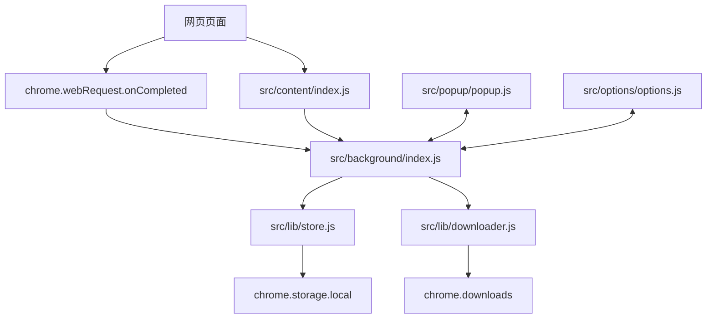

# 网络图片批量下载功能设计文档

## 1. 概述

### 1.1 问题/背景

用户在浏览网页时，经常需要保存页面中加载的多张图片。传统方式需要逐张打开、右键保存或借助站点特定脚本，效率低，且难以覆盖懒加载、CDN、接口返回图片等场景。

Open Download 通过 Chrome Extension Manifest V3 提供一个全局图片捕获和批量下载工具：用户开启监听后，扩展在后台观察所有网站的图片网络请求，将识别到的图片保存到本地扩展存储，并在 Popup 中提供预览、筛选、选择、导出和批量下载能力。

### 1.2 目标

- 支持用户一键开启或关闭全局图片请求监听。
- 自动识别浏览过程中加载的图片资源，并记录 URL、文件名、域名、MIME、大小、来源页面等信息。
- 在 Popup 中展示捕获统计、图片列表、搜索、筛选、选择和移除操作。
- 支持下载选中图片或当前筛选结果中的全部图片。
- 支持自动下载、保存目录、命名策略、下载并发、大小过滤、域名过滤、扩展名过滤、URL 去重等配置。
- 尽量保持扩展离线可用，无需构建流程和远程 UI 资源。

### 1.3 非目标

- 不拦截、修改或重写网站请求。
- 不绕过站点鉴权、付费墙、防盗链或浏览器下载限制。
- 不实现云端同步、账号体系或跨设备图片库。
- 不对图片做压缩、格式转换、OCR 或内容识别。

## 2. 用户场景

### 场景 1: 手动捕获并批量下载网页图片

**Given** 用户已经在 Chrome 中安装并启用 Open Download。  
**When** 用户打开 Popup，开启监听，并继续浏览目标网页。  
**Then** 扩展捕获图片请求，Popup 中实时展示图片列表，用户可选择部分图片并点击「下载选中」保存到默认目录。

### 场景 2: 使用筛选条件下载目标图片

**Given** 用户已捕获大量来自不同域名、格式和大小的图片。  
**When** 用户在 Popup 中输入关键词、最小大小或扩展名筛选条件。  
**Then** 列表只显示匹配图片，用户点击「全部下载」时仅下载当前筛选结果。

### 场景 3: 通过设置页调整下载策略

**Given** 用户希望自动保存浏览过程中加载的大图。  
**When** 用户进入 Options 页面，开启自动下载，设置最小文件大小、保存目录、命名方式和并发数。  
**Then** 后台监听命中图片后自动按新策略下载，并通过 `chrome.storage.local` 持久化配置。

### 场景 4: 清理和导出捕获列表

**Given** 用户已捕获一批图片记录。  
**When** 用户在 Popup 中点击「导出列表」。  
**Then** 扩展生成 JSON 文件，包含当前存储的图片记录；用户也可以清空列表，重置统计数据。

### 场景 5: 从右键菜单快速控制扩展

**Given** 用户不想打开 Popup。  
**When** 用户在扩展图标右键菜单中选择开启/关闭监听或清空图片列表。  
**Then** 后台更新监听状态或清理数据，并在 Popup 下次打开时反映最新状态。

## 3. 功能需求

### FR-1: 监听状态控制

- Popup 必须提供监听开关。
- Background 必须持久化 `enabled` 设置。
- Service Worker 启动或浏览器启动时，应根据已保存设置恢复监听状态。
- 重复开启监听不得重复注册相同 `webRequest` listener。

### FR-2: 图片请求捕获

- Background 使用 `chrome.webRequest.onCompleted` 观察 `<all_urls>` 请求。
- 仅处理 `details.type === 'image'` 的请求。
- 跳过 `chrome://` 和 `chrome-extension://` 内部协议。
- 从 URL 提取文件名和域名。
- 从响应头读取 `Content-Type` 和 `Content-Length`，用于展示和过滤。
- 捕获图片后通过 `MESSAGE_TYPES.IMAGE_FOUND` 通知已打开的 Popup。

### FR-3: 过滤与去重

- 支持按排除域名过滤捕获。
- 支持按扩展名白名单过滤捕获。
- 支持按最小和最大文件大小过滤捕获。
- 支持 URL 去重，默认相同 origin + pathname 只捕获一次。
- Popup 本地筛选支持关键词、最小大小和扩展名。

### FR-4: 图片列表展示

- Popup 必须展示捕获总数、已下载数和失败数。
- 图片列表按最新捕获优先展示。
- 图片项展示缩略图、文件名、域名、大小、MIME 和下载状态。
- 图片项支持选择、取消选择和移除。
- 空列表或无匹配筛选结果时展示空状态。

### FR-5: 批量下载

- 支持下载用户选中的图片。
- 支持下载当前筛选条件下的全部图片。
- 下载目录由 `settings.savePath` 控制，默认 `OpenDownload`。
- 文件命名支持 `original`、`domain`、`sequential` 三种策略。
- 并发下载数限制在 1 到 10，默认 3。
- 下载冲突策略使用 `uniquify`，避免覆盖用户已有文件。
- 每个下载任务需要更新图片状态为 `downloading`、`downloaded` 或 `failed`。

### FR-6: 设置管理

- Options 页面支持保存下载设置、过滤设置和去重设置。
- Options 页面支持恢复默认设置。
- 设置保存在 `chrome.storage.local` 中。
- 设置更新后，Background 应根据 `enabled` 状态同步开启或关闭监听。

### FR-7: 数据导出与清理

- Popup 支持导出当前图片记录为 JSON。
- Popup 支持清空所有图片记录和统计数据。
- 单张图片支持从列表中移除。

### FR-8: 页面图片尺寸补充

- Content Script 收集页面 `` 标签的 `src/currentSrc`、自然宽高和 alt 信息。
- Content Script 通过 MutationObserver 观察动态新增图片。
- Background 后续应处理 `CONTENT_IMAGES_UPDATE` 消息，将尺寸信息补充到已捕获图片记录中。

## 4. 实现方案

### 4.1 总体架构



### 4.2 Background

`src/background/index.js` 是业务编排层，负责：

- 根据 `enabled` 状态注册或移除 `chrome.webRequest.onCompleted`。
- 处理 Popup 和 Options 发来的消息。
- 使用 `ImageStore` 读取和更新图片、设置、统计数据。
- 使用 `DownloadManager` 执行单张或批量下载。
- 在扩展安装时创建右键菜单。
- 在启动时恢复监听状态。

消息处理应保持单一入口，通过 `MESSAGE_TYPES` 分发，新增功能需要优先扩展常量定义，避免散落硬编码字符串。

### 4.3 Store

`src/lib/store.js` 是数据访问层，负责：

- 初始化并缓存图片、设置和统计数据。
- 通过 `chrome.storage.local` 持久化数据。
- 添加图片时执行去重和默认字段补齐。
- 提供筛选、查找、移除、清空和状态更新方法。

存储结构应保持向后兼容。若后续新增字段，应在读取时提供默认值，避免旧数据导致 UI 报错。

### 4.4 Downloader

`src/lib/downloader.js` 是下载执行层，负责：

- 根据当前设置生成下载文件名和保存路径。
- 调用 `chrome.downloads.download` 发起下载。
- 监听 `chrome.downloads.onChanged`，等待完成或中断。
- 控制批量下载并发。
- 将下载结果回写到 Store。

下载失败不应阻断整个批次，单个任务失败后继续处理剩余图片，并在批量结束时返回成功和失败统计。

### 4.5 Popup

`src/popup/popup.js` 是主要操作界面，负责：

- 初始化时读取状态、统计和图片列表。
- 发送监听开关、列表查询、清空、下载、移除和导出消息。
- 维护当前选中集合和本地筛选条件。
- 渲染图片列表、空状态和下载状态。
- 接收 Background 的 `IMAGE_FOUND` 消息并增量刷新列表。

Popup 关闭后其内存状态会消失，重新打开时必须以 Background/Store 返回的数据为准。

### 4.6 Options

`src/options/options.js` 是配置界面，负责：

- 读取设置并填充表单。
- 将表单字段转换为 `DEFAULT_SETTINGS` 兼容的数据结构。
- 保存设置或恢复默认设置。
- 展示保存结果提示。

Options 不直接操作图片列表或下载任务，保持配置职责单一。

### 4.7 Content Script

`src/content/index.js` 是页面增强层，负责：

- 扫描页面 `` 标签。
- 监听动态新增图片。
- 将图片尺寸信息发送给 Background。

该模块不应直接写入 storage，也不应执行下载。所有持久化和下载仍由 Background 统一处理。

## 5. 边界情况

| 场景 | 处理方式 |
|------|---------|
| Popup 未打开时捕获到图片 | 图片写入 Store，`sendMessage` 失败时忽略错误 |
| Service Worker 被 Chrome 回收 | 下次启动时调用 `store.init()`，根据 `enabled` 恢复监听 |
| 重复开启监听 | `startListening()` 通过 `isListening` 防止重复注册 |
| 图片没有 `Content-Length` | 大小记为 0，展示为未知，大小过滤仅在有长度时生效 |
| 图片 URL 没有扩展名 | 文件名解析失败时使用 `unknown`，下载文件名默认补 `.jpg` |
| 下载文件名包含非法字符 | `sanitizeFilename()` 替换非法字符并限制长度 |
| 下载超时 | 120 秒后标记失败，并继续批量任务 |
| 下载中断 | 标记失败并返回错误信息 |
| 已保存图片过多 | Store 最多保留 5000 条，超出后保留最新记录 |
| 图片跨域缩略图加载失败 | Popup 隐藏缩略图并展示占位图 |
| `data:image/` URL 过长 | Popup 当前只截取前 200 字符作为缩略图来源，后续应评估完整展示或跳过策略 |
| Content Script 尺寸更新无人处理 | 当前为已知缺口，后续应补齐 Background 消息处理 |

## 6. 涉及文件

- `src/manifest.json`
- `src/background/index.js`
- `src/content/index.js`
- `src/lib/constants.js`
- `src/lib/store.js`
- `src/lib/downloader.js`
- `src/lib/utils.js`
- `src/popup/index.html`
- `src/popup/popup.js`
- `src/popup/popup.css`
- `src/options/index.html`
- `src/options/options.js`
- `src/options/options.css`
- `src/assets/icon-16.png`
- `src/assets/icon-48.png`
- `src/assets/icon-128.png`
- `scripts/build.js`
- `dist/`

## 7. 数据结构

### 7.1 图片记录

```js
{
  id: string,
  url: string,
  filename: string,
  domain: string,
  mimeType: string,
  size: number,
  width: number,
  height: number,
  capturedAt: number,
  tabUrl: string,
  tabTitle: string,
  downloaded: boolean,
  status: 'pending' | 'downloading' | 'downloaded' | 'failed'
}
```

### 7.2 设置

```js
{
  enabled: boolean,
  autoDownload: boolean,
  minImageSize: number,
  maxImageSize: number,
  concurrency: number,
  savePath: string,
  dedupe: boolean,
  fileNaming: 'original' | 'domain' | 'sequential',
  filters: {
    domains: string[],
    extensions: string[],
    minDimensions: {
      width: number,
      height: number
    }
  }
}
```

### 7.3 统计

```js
{
  total: number,
  downloaded: number,
  failed: number
}
```

## 8. 权限与隐私

扩展需要以下权限：

- `webRequest`: 观察图片网络请求。
- `downloads`: 下载图片到本地。
- `storage`: 持久化图片记录、设置和统计。
- `notifications`: 预留下载或状态通知能力。
- `contextMenus`: 创建扩展右键菜单。
- `host_permissions: <all_urls>`: 支持全站点图片请求观察和 content script 注入。

隐私处理原则：

- 捕获数据仅保存在本地 `chrome.storage.local`。
- 不上传图片 URL、页面 URL 或任何用户数据到远程服务。
- 导出 JSON 由用户主动触发。
- 清空列表时应同时清空图片记录和统计数据。

## 9. 验收标准

- 安装为 unpacked extension 后，Popup 可以正常打开，无控制台阻塞错误。
- 开启监听后浏览包含图片的网页，Popup 能展示新增图片记录。
- 图片记录至少包含 URL、文件名、域名、大小或未知大小、MIME 或未知 MIME。
- 关闭监听后继续浏览网页，不再新增捕获记录。
- 搜索 URL、文件名或域名时，列表结果正确收敛。
- 设置最小大小和扩展名筛选后，「全部下载」只下载筛选结果。
- 点击图片项可选中或取消选中，点击移除只删除该图片。
- 「下载选中」在未选择图片时提示用户，在有选择时执行下载并更新状态。
- 「全部下载」在无图片时提示用户，在有图片时执行批量下载。
- Options 保存设置后，重新打开 Options 和 Popup 能读到新设置。
- 右键菜单可以开启/关闭监听和清空图片列表。
- 导出列表会生成可下载 JSON 文件，内容与当前 Store 图片记录一致。
- `npm test` 通过，覆盖 URL 解析、文件名生成、去重、筛选、设置合并、下载管理和 background 尺寸回写。

## 10. 后续改进建议

- 实现 `scripts/pack.js` 或移除 `npm run pack`，避免交付命令不可用。
- 扩展自动化测试到 Popup 和 Options DOM 交互。
- 增加下载进度消息，让 Popup 在批量下载过程中实时刷新状态。
